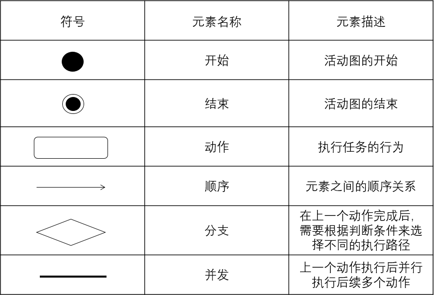
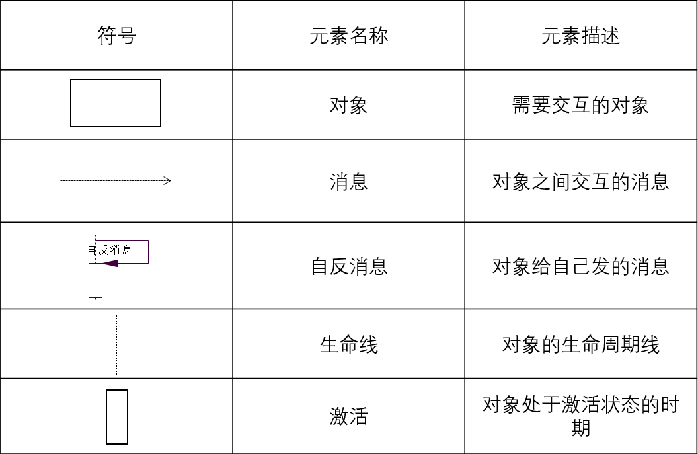

## 第一章

### 第一节 软件

软件由程序、数据和文档组成。

程序：按事先设计的功能和性能需求执行的指令序列。

数据：程序能正常操纵信息的数据结构。

文档：与程序开发、维护和使用有关的图文材料

软件产品的开发主要是研制。

#### 一、软件的特点的作用

软件的特点：

* 软件不会磨损和老化
* 软件无明显的制造过程
* 软件生产是简单的拷贝
* 软件的开发进度几乎没有客观衡量标准
* 需要高成本

软件的双重作用：

* 提供计算能力
* 产生、管理、获取、修改、显示或传输信息
* 作为开发其他软件产品的工具

#### 二、软件的分类

软件的分类：

* 系统软件

  担负控制和协调计算机及其外部设备、支持应用软件的开发和运行的一类计算机软件。

  例如：操作系统、数据库管理系统。

* 应用软件

  直接面向用户需要。

  例如：商业数据处理软件、医疗软件。

* 支撑软件

  是支撑各种软件的开发与维护的软件。

  例如：文本编辑程序、文件格式化程序、程序库系统。

软件按功能分类可划分为系统软件、应用软件、嵌入式软件、产品线软件、web应用软件、人工智能软件、工程/学科软件。

#### 三、软件危机

软件危机：在计算机软件的开发和维护过程中所遇到的一系列严重问题。（效率和质量下降）

软件危机产生原因：

* 客观原因—软件本身

  逻辑部件问题

  规模庞大

* 主观原因—不正确的开发方法

* 忽视需求分析

* 错误的认为软件开发等于程序编写

* 轻视软件维护

解决软件危机的方法：按工程化的原则和方法组织软件开发工作，并制定相应的标准。

软件工程的出现主要由于软件危机的出现。

### 第二节 软件工程（方法学）

软件工程的定义：

（1）将系统化的、规范的、可量化的方法应用于软件的开发、运行和维护，即将工程化应用于软件；

（2）对（1）中所述方法的研究。

软件工程的目标是在给定的时间和预算内，按照用户的需求，开发易修改、高效、可靠、可维护、适应力强、可移动、可重用的软件。

支持软件工程的根基是质量关注点。

软件工程三要素：

* 过程

  软件工程将各个技术层次结合在一起，使得合理、及时地开发计算机软件成为可能。

* 方法

  为构建软件提供技术上的解决方法。

* 工具

  为过程和方法提供自动化或半自动化的支持。

软件工程得以实施的主要保证是软件开发工具和软件的开发环境。

软件工程发展的四个阶段：

* 第一代软件工程

  传统的软件工程

* 第二代软件工程

  对象工程

* 第三代软件工程

  过程工程

* 第四代软件工程

  构件工程

软件工程的七个原则：

* 使用阶段性生命周期计划的管理
* 进行连续的验证
* 保证严格的产品控制
* 使用现代变成工具或工程实践
* 保持清晰的责任分配
* 用更好更少的人
* 保持过程改进

## 第二章 过程模型

软件生命周期的定义：软件产品或软件系统从设计、投入使用到被淘汰的全过程。

软件过程的定义：软件生产的一系列活动，这些活动贯穿于软件开发的整个过程。

软件过程的通用框架活动：

* 沟通

* 策划

  软件开发小组讨论使用何种方法及和种工具来实现客户需求。

* 建模

* 构建

  即编码和测试。

* 部署

软件生存周期划分为软件定义、软件开发和运行维护三个阶段，每个阶段又可细分为若干更小的阶段。用户的参与主要在软件定义阶段。

软件过程模型是软件开发全部过程、活动和任务的结构框架。它能直观表达软件开发全过程，明确规定要完成的主要活动、任务和开发策略。

软件过程模型也常称为软件开发模型、软件生存周期模型或软件工程范型。

典型的软件过程模型有瀑布模型、增量模型、演化模型（原型模型、螺旋模型）、喷泉模型、基于构件的开发模型和敏捷开发模型等。

### 第一节 瀑布模型

什么是瀑布模型（Waterfall Model）：

* 瀑布模型规定了各项软件工程活动，以及它们自上而下，相互衔接的固定次序，如同瀑布流水，逐级下落。
* 瀑布模型是一种使用广泛、以文档为驱动的模型。

瀑布模型的特点：

* 阶段间具有顺序性和依赖性。
* 推迟实现的观点。
* 每个阶段必须完成规定的文档；每个阶段结束前完成文档审查，及时改正错误。

瀑布模型是软件开发的基础模型。

瀑布模型的缺点：

* 线性过程过于理想化，各个阶段的划分完全固定，阶段之间产生大量的文档，极大地增加了工作量。
* 由于开发模型是线性的，缺乏灵活性，用户只有等到整个过程的末期才能见到开发成果，从而增加了开发的风险。
* 早期的错误可能要等到开发后期的测试阶段才能发现，进而带来严重的后果。

瀑布模型适用于系统需求明确、技术成熟、工程管理较严格的场合。

瀑布模型把软件生命周期划分为八个阶段：

* 问题定义

* 可行性研究

  研究问题的范围，思考问题是否值得去解决，是否有可行的解决办法。

  可行性研究目的是决定项目是否值得开发。

  从软件的功能可行性角度考虑的是技术可行性。

  从研究开发所需要的成本和资源角度考虑的是经济可行性。

* 需求分析

  编写初步的用户手册

* 概要设计（总体设计）

  制订组装测试计划

* 详细设计

* 编码和单元测试

* 综合测试

* 软件维护

八个阶段又可归纳为三个打的阶段：计划阶段、开发阶段、运行阶段。

瀑布模型为结构化生命周期的软件开发方法。

### 第二节 增量过程模型

什么是增量过程模型：

* 增量过程模型是一种非整体开发的模型，是一种进化式的开发过程。
* 它允许从部分需求定义出发，先建立一个不完整的系统，通过测试运行这个系统取得经验和反馈，进一步使系统扩充和完善。如此反复进行，直至软件开发相关人员和用户对所设计的软件系统满意为止。

增量过程模型包括增量模型与快速应用开发模型。

#### 一、增量模型

增量模型的特点：

* 增量为小而可用的软件。
* 在前面增量的基础上开发后面的增量。
* 每个增量的开发可用瀑布或快速原型模型。
* 采用迭代的思想。
* 本质上是一种线性顺序模型。

增量模型的优点：

* 增量包概念的引入，以及它不需要提供完整的需求。只要有一个增量包出现，开发就可以进行。
* 在项目的初始阶段不需要投入太多的人力资源。
* 增量可以有效地管理技术风险。

增量模型的缺点：

* 每个增量必须提供一些系统功能，这使得开发者很难根据客户需求给出大小适合的 增量。

#### 二、快速应用开发模型

什么是快速应用开发模型（RAD）：

* 快速应用开发模型（RAD）是增量过程模型的一种，强调短暂的开发周期。
* 快速应用开发模型是瀑布模型的“高速”变体，通过基于组件的构建方法实现快速开发。

快速应用开发模型的缺点：

* 对大型项目而言，RAD 需要足够的人力资源。 
* 开发者和客户都要实现承诺，否则将导致失败。
* 不能合理模块化的系统、高性能需求并且要调整构件接口的、技术风险很高的系统均不适合。

### 第三节 演化过程模型

演化过程模型的思想是首先实现软件的最核心的、最重要的功能。

演化过程模型包括原型模型和螺旋模型。

#### 一、原型模型

什么时候适合用原型模型：

* 客户定义一个总体目标集，但是他们并不清楚系统的具体输入输出。
* 开发者不确定算法的效率、软件与操作系统是否兼容以及客户与计算机交互的方式。

原型模型的缺点：

* 设计者在质量和原型间有所折衷。
*  客户意识不到 一些质量问题。

#### 二、螺旋模型

螺旋模型与RAD模型相似，螺旋模型结合了瀑布模型和原型模型的特点。适用于大型系统的开发。

螺旋模型的实施过程基本上与原型模型相吻合。

四个方面的活动：

* 制定计划
* 风险分析
* 实施工程
* 客户评估


螺旋模型的优点：

* 支持用户需求的动态变化。 
*  原型可看作形式上的可执行的需求规格说明，易于为用户和开发人员共同理解，还可作为继续开发的基础，并为用户参与所有关键决策提供了方便。 
* 螺旋模型特别强调原型的可扩充性和可修改性，原型的进化贯穿整个软件生存周期， 助于目标软件的适应能力。 
* 螺旋模型为项目管理人员及时调整管理决策提供了方便，进而可降低开发风险。

螺旋模型的缺点：

* 如果每次迭代的效率不高，致使迭代次数过多，将会增加成本并推迟提交时间
* 使用该模型需要有相当丰富的风险评估经验和专门知识，要求开发队伍水平较高。

螺旋模型适应场合：支持需求不明确、特别是大型软件系统的开发，并支持面向规格说明、面向过程、 面向对象等多种软件开发方法，是一种具有广阔前景的模型。

### 第四节 喷泉模型

什么是喷泉模型：喷泉模型是一种以用户需求为动力，以对象为驱动的模型，主要用于描述面向对象的软件开发过程。

喷泉模型的优点：该模型的各个阶段没有明显的界限，开发人员可以同步进行开发。可以提高软件项目开发效率，节省开发时间，适应于面向对象的软件开发过程。

喷泉模型的缺点：由于喷泉模型在各个开发阶段是重叠的，在开发过程中需要大量的开发人员，因此不利于项目的管理。此外这种模型要求严格管理文档，使得审核的难度加大，尤其是面对可能随时加入各种信息、需求与资料的情况。

### 第五节 基于构件的模型

四个阶段：

* 需求
* 组件分析
* 系统设计
* 开发和集成

基于构件的模型优点：组件的重用，降低了成本和风险，节约了时间。

基于构件的模型缺点：

* 模型复杂，导致需求的折衷，进而导致系统不能完全符合需求。
* 无法完全控制所开发系统的演化。
* 项目划分的好坏直接影响项目结果的好坏。

### 第六节 敏捷开发模型

敏捷软件开发(Agile software development）模型是一种精简的、快速的、增量迭代的系统开发过程模型。

敏捷开发模型包括极限编程（XP）、SCRUM、自适应软件开发（ASD）和动态系统开发方法（DSDM）等。

## 第三章 需求分析

需求分析的定义：确定系统必须具有的功能和性能，系统要求的运行环境，并且预测系统发展的前景。即需求以一种清晰、简洁、一致且无二义性的方式，对一个待开发系统中各个有意义方面的陈述的一个集合。

在软件需求规范中，执行要求可归类为过程要求。

### 第一节 需求分析的过程

需求分析的过程：需求确认与需求变更。

需求分析（确认）的步骤：需求获取、需求提炼、需求描述和需求验证。

需求分析可以分为对问题的识别、分析与综合、编写需求分析文档和需求分析评审。

需求分析的核心在于建立分析模型。

#### 一、需求获取

软件需求获取指的是软件需求的来源以及软件工程师收集这些软件需求的方法。

需求获取也称为需求抓取、需求发现和需求获得。

需求类型：

* 功能性需求

* 非功能性需求

  必须遵循的标准， 外部界面的细节， 实现的约束条件， 质量属性等等

需求获取面临的挑战：客户说不清楚需求、需求易变性、问题的复杂性和对问题空间理解的不完备性与不一致性。

结束的标准是关于规模和目标的报告书。

#### 二、需求提炼

什么是需求提炼：对应用问题及环境的理解和分析，为问题涉及的信息、 功能及系统行为建立模型。将用户需求精确化、完全化，最终形成下一步的需求规格说明书。

可行性研究阶段的结束标准是成本/效益分析和数据流图。

#### 三、需求描述

撰写需求规格说明书。

软件需求规格说明书（SRS）的定义：软件系统的需求规格说明，是对待开发系统的行为的完整描述。它包含了功能性需求和非功能性需求。

需求分析工作完成的一个基本标志是形成了一份完整的、规范的需求规格说明书。

需求规格说明书的编制是为了使用户和软件开发者双方对该软件的初始规定有一个共同的理解，使之成为整个开发工作的基础。

需求规格说明书的结构：

```
（1）引言
（2）综合描述
	a.产品前景
	b.产品功能
	c.用户特征
	d.运行环境
	e.设计与实现上的限制
	f.假设和依赖性
（3）需求描述
	a.功能需求
	b.数据需求
		与功能有关的数据定义和数据关系
	c.性能需求
	d:外部接口
		用户界面、软硬件接口、通信接口
	e.设计约束
		软件支持环境、报表、数据命名等
	f.软件质量属性
		可维护性、可靠性、可移植性等
	g.其他需求
（4）附录（词汇表、分析模型、待定问题列表）
（5）索引
```

#### 三、需求验证

对需求文档需执行以下类型的检查：

* 有效性检查

  检查不同用户使用不同功能的有效性。

* 一致性检查 

  在文档中，需求之间不应该冲突。

* 完备性检查

  需求文档应该包括所有用户想要的功能和约束。

* 可行性检查

  检查保证能利用现有技术实现需求。

需求验证技术：

* 使用判定表进行需求评审。
* 利用原型检验系统是否符合用户的真正需要。
* 对每个需求编写概念性的测试用例。
* 编写用户手册。用浅显易懂的语言描述用户可见的功能。 
* 自动的一致性分析。可用CASE工具检验需求模型的一致性。

### 第二节 面向过程

结构化设计（Structured Design，SD）是最为广泛应用的一种，这种方法可以用分析阶段的SA方法及编程阶段的SP方法前后衔接。

#### 一、结构化分析方法

结构化分析（Structured Analysis，简称SA）模型的基本思想是用系统工程的思想和工程化的方法， 根据用户至上的原则，自始自终按照结构化、模块化，自顶向下地对系统进行分析与设计。

结构化分析是一种面向数据流的方法。

在面向数据流的软件设计方法中，一般将信息流分为变换流和事务流。

SA方法的分析步骤是首先调查了解当前系统的工作流程， 然后获得当前系统的物理模型，抽象出当前系统的逻辑模型，建立目标系统的物理模型。

SA方法以数据流图、数据字典和加工说明等描述工具，来描述软系统模型。

#### 二、分析建模

|          |         面向过程的需求分析         |        补充        |
| :------: | :--------------------------------: | :----------------: |
| 数据模型 | 实体-联系图（ERD）、数据字典（DD） | 描述系统的数据结构 |
| 功能模型 |          数据流图（DFD）           |   描述系统的功能   |
| 行为模型 |         状态变迁图（STD）          |                    |

##### （一）数据流图

数据流图（Data Flow Diagram，DFD）用以表达系统内数据的运动情况。


画分层DFD图的基本原则：

* 数据守恒原则
* 子、父图平衡的原则
* 数据流封闭原则

通过功能分解可以完成数据流图的细化。

##### （二）实体-联系图

实体联系图（Entity Relationship Diagram，ERD）是用来建立数据模型的工具。

数据模型是一种面向问题的数据模型，是按照用户的观点对数据建立的模型。

数据模型中包含3中相互关联的信息：

* 数据对象（或实体）
* 数据对象的属性
* 联系（关系）

##### （三）结构图

SC图（Structure Chart，结构图）是软件工程中面向数据流设计方法中的一种描述工具，专门用来描述软件的总体结构。

结构图中，模块框之间若有直线连接，表示它们之间存在调用关系。

数据流图导出结构图的关键是找到中心变换。

##### （四）层次方框图

层次方框图与结构图类似，但层次方框图描绘的是数据结构。


##### （五）Jackson图


Jackon图中，模块框之间若有直线连接，表示它们之间存在组合关系。

##### （六）加工描述方法

常用的加工描述方法有结构化语言、判定树和判定表。

判定表又称决策表，能够清楚地表达复杂的条件组合与应做的动作之间的对应关系。


判定树又称决策树，适合描述问题处理中具有多个判断，而且每个决策与若干条件有关。

判定表和判定树常描述对象的组合条件。

描述组合条件，利用结构化语言的条件语句就比较困难，很难做到清楚、易理解，通常采用判定表和判定树。

在软件结构设计中，扇出是指下级模块的数目，扇入是指有直接调用该模块的上级模块的数目。观察大量的软件系统发现，设计得很好的软件结构通常顶层扇出较高，中层扇出较少，底层模块有高扇入。

#### 三、结构化程序设计

结构化程序设计（Structured Programming，SP）三种基本控制结构是：顺序、选择和循环结构。

结构化设计方法在软件开发中用于概要设计。

### 第三节 面向对象

#### 一、面向对象的分析方法

面向对象分析（Object-Oriented Analysis，OOA）模型由5个层次（主题层、对象类层、结构层、属性层和服务层）和5个活动（标识对象类、标识结构、定义主题、定义属性和定义服务）组成。

对象建模技术（Object Modeling Technique，OMT）定义了三种模型：对象模型、功能模型和动态模型。

|          |   面向对象的需求分析   |                        备注                        |
| :------: | :--------------------: | :------------------------------------------------: |
| 对象模型 |          类图          | 核心，面向对象分析的首要工作是建立在问题的对象模型 |
| 功能模型 |         用例图         |                                                    |
| 动态模型 | 活动图、时序图、状态图 |                                                    |

UML(Unified Modeling Language)是一种面向对象的可视化建模语言。

UML是一个通用的标准建模语言，它可以对系统的静态结构和动态行为进行建模。可用于系统开发的不同阶段阶段建模，如从系统需求分析到系统测试与维护。

在面向对象的系统中，对象是基本的运行时的实体，它既包括数据，也包括作用于数据的操作，所以一个对象的定义包括它的静态属性和动态操作的定义。

#### 二、分析建模

##### （一）用例图


1）参与者

人：在组织中，人可能会有一个或多个角色，一个角色又通常与一个岗位对应，每个岗位有一定职责。

外部系统：一般来讲，待开发的目标系统不会是孤立的，它可能与其他系统发生数据交互、业务流程交互以及接口访问等关系。无论这些系统是已经存在的、正在开发的或者待开发的，均可以作为待开发系统的参与者。

设备：主要指硬件设备，比如传感器、摄像头和车辆等具有一定数据处理功能的物理设备。这些设备可能为系统提供数据，也可能接收来自系统的数据并进行存储，还可能接收系统的数据进行处理后反馈给系统。

2）用例

用例间的关系：包含、扩展。

* 包含

  用例A包含用例B表示用例B是用例A的一部分，执行用例A就一定会执行用例B（可理解为先执行B，再执行A），但用例B可以独立执行。用例A被称为基用例，用例B被称为包含用例，包含关系用从用例A指向用例B的虚线箭头表示，并在箭头上标注`<<include>>`或`<<包含>>`标识。

* 扩展

  用例A扩展了用例B有两层含义，一层含义是无论用例A执行与否，用例B均会执行；另一层含义是在某些条件下，用例A会执行。用例A是扩展用例，用例B是被扩展用例，扩展关系用从用例A指向用例B的虚线箭头表示，并在箭头上方用`<<extend>>`或`<<扩展>>`标识。

错误的登录用例：


正确的登录用例1：


正确的登录用例2：


四轮马车的错误：把管理员的用户管理划分为四个用例，即增、删、改、查。这样造成系统建模蜕变成关系数据库的建模，关心的是数据的存储和维护，而忽略了用户的目的。根据粒度适度原则，如果CRUD不涉及复杂的交互，即一个用例即可。

错误的用户管理用例：


正确的用户管理用例：


带有较为复杂的增加用户操作的正确的用户管理用例：


##### （二）活动图

活动图（Acitivity Diagram）是描述活动、活动执行顺序以及活动输入/输出的图。活动图用于描述业务流程或系统流程。活动图类似于流程图，其描述的流程可能发生在用例内，也可能发生在用例间。



##### （三）顺序图

顺序图又称为事件追踪图。

顺序图（Sequence Diagram）是一种描述对象间消息传递次序的交互图。它描述了在用例或操作的执行过程中对象如何通过消息相互交互，说明了消息如何在对象之间被发送、接收以及发送的顺序。



##### （三）状态图

面向对象的动态模型中，每张状态图表示某一个类的动态行为。

#### 三、面向对象设计

面向对象设计（Object-Oriented Design，OOD）模型由4个部分组成，包括问题域部分、人机交互部分、任务管理部和数据管理。

一个面向对象系统的体系结构通过它的成分对象和对象间的关系确定，与传统的面向数据流的结构化开发方法相比，它具有设计稳定的优点。

#### 四、面向对象编程

面向对象编程（Object Oriented Programming，OOP）

面向对象程序设计语言不同于其他语言的最主要特点是继承性。

封装的目的是使对象的定义和实现分离，是一种信息隐蔽技术。

## 第四章 系统设计

软件设计的定义：软件系统或组件的架构、构件、接口和其他特性的定义过程及该过程的结果。

系统设计分为概要设计和详细设计。

### 第一节 设计过程和质量

确定软件系统的运行平台是在软件设计阶段考虑的问题。

#### 一、设计质量属性

* 功能性
* 易用性
* 可靠性
* 性能
* 可支持性
  * 扩展性
  * 适应性
  * 可维护性

McCall软件质量模型从产品运行、产品转移、产品修正三个方面确定了11个质量特性：

* 产品运行

  正确性、可靠性、易使用性、效率和完整性

* 产品转移

  可移植性、复用性和互用性

* 产品修正

  可维护性、灵活性和可测试性

#### 二、与设计相关的8个概念：

##### （一）抽象

即忽略具体的信息将不同事物看成相同事物的过程。

##### （二）体系结构

即软件的整体结构和这种结构为系统提供概念上完整性的方式。

##### （三）设计模式

即在给定上下文环境中一类共同问题的共同解决方案。

* 实体模式：抽象工厂模式、原型模式等
* 结构模式 ：装饰器模式、代理模式等
* 行为模式：观察者模式、解释器模式等

##### （四）模块化

即软件被划分为命名和功能相对独立的多个组件，通过这些组件的集成来满足问题的需求。

软件重用的单位是软件模块。

模块作用域定义为受该模块内一个判断影响的所有模块集合。

模块化的分解性：可分解为子问题

模块化的组合性：组装可重用的组件

模块化的可理解性：可作为独立单元理解

模块化的连续性：需求小变化只影响单个模块

模块化的保护：模块内异常只影响自身

模块化基本问题：如何分解软件系统以达最佳的模块划分

##### （五）信息隐藏

即模块定义和设计时应当保证模块内的信息不可以被不需要这些信息的其他模块访问。

特点：

* 抽象有助于定义构成软件的过程或信息实体。
* 信息隐藏原则定义和隐藏了模块内的过程细节和模块内的本地数据结构。

##### （六）功能独立

即每个模块只负责需求中特定的子功能，并且从程序结构的其他部分看，该模块具有简单的接口。

模块的独立性是由内聚性和耦合性来度量的：

* 内聚性：模块的功能相对强度

  为了提高模块的独立性，模块内部最好是功能内聚。

  内聚性从低到高依次为：偶然内聚、逻辑内聚、时间/瞬时内聚、过程内聚、通信/信息内聚、顺序内聚、功能内聚。

  * 偶然内聚

  * 逻辑内聚

  * 时间内聚

  * 过程内聚

  * 通信内聚

  * 顺序内聚

  * 功能内聚

* 耦合性：模块之间的相互依赖程度

  耦合性从低到高依次为非直接耦合、数据耦合、标记/特征耦合、控制耦合、外部耦合、公共耦合、内容耦合。

  * 非直接耦合：多个模块之间没有直接联系，通过主模块的控制和调用实现联系被称为非直接耦合，这也是一种理想的耦合方式。

  * 数据耦合：多个模块通过简单数据参数来交换信息被称为数据耦合，可以类比 JAVA 语言值传递。

  * 标记耦合：多个模块通过参数表传递数据结构信息被称为标记耦合，可以类比 JAVA 语言引用传递。

  * 控制耦合：模块之间传递信息中包含用于控制模块内部的信息被称为控制耦合。控制耦合可能会导致模块之间控制逻辑相互交织，逻辑之间相互影响，非常不利于代码维护。

  

  * 外部耦合：多个模块访问同一个全局简单变量（非全局数据结构）并且不是通过参数表传递此全局变量信息被称为外部耦合。

  * 公共耦合：多个模块都访问同一个公共数据环境被称为公共耦合，公共数据环境例如全局数据结构、共享通信区和内存公共覆盖区。

  * 内容耦合：一个模块可以直接访问另一个模块的内部数据被称为内容耦合，这是耦合性最强的类型，这也是我们需要尽量避免的。

* 模块独立性强 = 高内聚低耦合

##### （七）细化

即逐步求精的过程	。

与抽象的关系：

* 抽象使设计师确定过程和数据，但不局限于底层细节。
* 细化有助于设计者在设计过程中揭示底层细节

##### （八）重构

不改变组件功能和行为条件下，简化组件设计或代码的一种重组技术。

### 第三节 概要设计

结构化程序设计在概要设计阶段实现，概要设计结束后得到优化后的软件结构图。

概要设计可用到层次图、结构图。

概要设计包括数据设计、架构设计、接口设计等。

### 第四节 详细设计

模块化设计在详细阶段完成。

设计软件结构一般不确定模块内的局部数据。

模块的作用范围应该在模块的控制范围之内。

详细设计的主要任务是确定每个模块的算法和使用的数据结构。

Jackson方法是面向数据结构的方法，实现从数据流图导出程序结构。

详细设计主要采用的方法是结构化程序设计。

详细设计工具可以分为以下三类： 

* 图形设计符号：结构化流程图、盒图、问题分析图（Problem Analysis Diagram，PAD）、输入加工输出（Input Process Output，IPO）图、HIPO图
* 表格设计符号：决策表（又称判定表）、决策树（又称判定树）
* 程序设计语言：PDL

## 第五章 质量保证

缺乏规定的一致性就是缺乏软件的质量

软件需求是软件质量测量的基础

质量保证：系统地监测和评估一个工程的各个方面，以最大限度地提高正在由生产过程中实现的质量的最低标准。

软件测试：在某种指定的条件下对系统或组件进行操作并观察或记录结果，对系统或组件的某些方面进行评估的过程。

软件缺陷：至少满足下列一个条件，称发生了一个软件缺陷

* 软件未实现产品说明书要求的功能
* 软件出现了产品说明书指明不能出现的错误。
* 软件实现了产品说明书未提到的功能。
* 软件未实现产品说明书虽未明确提及但应该实现的目标。
* 软件难以理解、不易使用、运行缓慢或者从测试员的角度得知最终用户会认为不好。

验证（Verification）：保证软件特定开发阶段的输出已经正确完整地实现了规格说 明（我们正确地构造了产品吗？）

确认（Validation）: 对于每个测试级别，都要检查开发活动的输出是否满足具体的需求或与这些特定级别相关的需求（我们构造了正确的产品吗？）

质量与可靠性：功能性 、可靠性、可维护性、可用性、可移植性

软件调试与测试：

* 两者都包含有处理软件缺陷和查看代码的过程
* 测试的目标是发现软件缺陷的存在，调试的目标是定位与修复缺陷

### 第一节 软件测试的过程模型

软件测试的过程模型—V模型：


模型非常明确地标明了测试过程中存在的不同级别，并且清楚地描述了这些测试阶段和开发过程期间各阶段应关系： 

* 单元测试的主要目的是验证软件模块是否按详细设计的规格说明正确运行。
* 集成测试主要目的是检查多个模块间是否按概要设计说明的方式协同工作。 
* 系统测试的主要目的是验证整个系统是否满足需求规格说明。
* 验收测试从用户的角度检查系统是否满足合同中定义的需求，以及以确认产品是否能符合业务上的需要。

### 第二节 软件测试阶段

软件测试阶段图：


测试的关键问题是如何选取测试用例。

成功的测试是指运行测试用例后发现了程序错误。

#### 一、静态测试

静态测试，即静态分析，指不实际运行程序，通过检查和阅读等手段来发现错误并评估代码质量的软件测试技术。

静态分析的主要内容：检查需求、检查设计、检查代码。

步骤：计划、概述、准备、评审会议、返工、跟踪。

静态分析类型：

|          |           走查           |                             审查                             |
| :------: | :----------------------: | :----------------------------------------------------------: |
|   准备   |      通读设计和编码      | 应准备好需求文档、程序设计文档、程序的源代码清单、代码编码标准和代码缺陷检查表 |
|   形式   |        非正式会议        |                           正式会议                           |
| 参加人员 |       开发人员为主       |                    项目组成员包括测试人员                    |
| 主要技术 |            无            |                          缺陷检查表                          |
| 注意事项 |  限时、不要现场修改代码  |                    限时、不要现场修改代码                    |
| 生成文档 |         会议记录         |                       静态分析错误报告                       |
|   目标   | 代码标准规范，无逻辑错误 |                   代码标准规范，无逻辑错误                   |

#### 二、动态测试

##### （一）单元测试

测试执行者：编程人员和测试人员

测试内容：

* 单元路径测试

* 局部数据结构测试

  变量是否无初值、变量初始化或默认值是否出错、是否出现上溢或下溢和地址异常

* 单元接口测试

  输入的实际参数与形式参数在个数、数据类型、顺序上是否一直；外部输入、输出是否正确

* 单元边界条件测试

* 单元容错测试

  异常处理是否恰当

* 内存分析

测试方法：黑盒测试与白盒测试

测试结果分析评估：代码覆盖率、分支或条件覆盖率

单元测试的计划是在详细设计阶段制订的。


##### （二）集成测试

集成测试又称组装测试。

集成测试是指将多个相关功能模块组装构成的子系统或系统所进行的集成接口测试。集成测试是将已经通过单元测试的若干模块按设计要求组装起来，然后再进行的测试，它主要检查这些单元模块之间的接口是否存在问题，包括接口参数的一致性引用、业务流程端到端的正确性等。

集成测试的主要方法：

* 自顶向下的集成方法

  缺点是桩的开发量较大。

* 自底向上的集成方法

  优点是每个模块调用其他底层模块都已经测试，不需要桩模块。

  缺点是每个模块都必须编写驱动模块；缺陷的隔离和定位不如自顶向下。

* 冒烟测试

集成测试模式：渐增式测试模式和非渐增式测试模式。

在渐增式测试模式下，自顶向下、自底向上和混合的集成方法对比：

|                      | 自底向上 | 自顶向下 | 混合策略 |
| :------------------: | :------: | :------: | :------: |
| 基本控制程序集成时间 |    迟    |    早    |    早    |
|   是否需要驱动程序   |    是    |    否    |    是    |
|    是否需要桩程序    |    否    |    是    |    是    |
|        并行度        |    中    |    低    |    高    |
|  测试特定路径的能力  |    易    |    难    |    易    |
| 计划与控制顺序的能力 |    难    |    易    |    易    |

集成测试的计划是在概要设计阶段制订的。

##### （三）系统测试

系统测试基本上使用黑盒测试方法。

系统测试的分类：功能性测试 、性能测试、压力测试、恢复测试、安全测试、配置测试、兼容性测试、本地化测试、文档测试、易用性测试等。

##### （四）验收测试

验收测试又称为确认测试。

验收测试的任务是验证软件的有效性。

验收测试的计划是在需求分析阶段制订的。

验收测试是以用户为主的测试。软件开发人员和QA（质量保证）人员也应参加。

由用户参加设计测试用例，使用生产中的实际数据进行测试。

α测试是由一个用户在开发环境下进行的测试，也可以是公司内部的用户在模拟实际操作环境下进行的测试。

β测试是由软件的多个用户在实际使用环境下进行的测试。通过收集试用用户的反馈意见，对该版本软件进行修正与完善，最终得到正式发布的版本。

只有当α测试达到一定的可靠程度时，才能开始β测试。

##### （五）回归测试

在软件测试的各个阶段，在修正发现的软件缺陷或增加新功能时，变化的部分必须进行再测试。此外，对软件进行修改还可能会导致引入新的软件缺陷以及其他问题。 为解决这些问题，需要进行回归测试。

回归测试是指有选择地重新测试系统或其组件，以验证对软件的修改没有导致不希 望出现的影响，以及系统或组件仍然符合其指定的需求。

回归测试可以在所有的测试级别执行，并应用于功能和非功能测试中。

回归测试应该尽量采用自动化测试。

回归测试的范围：

* 缺陷再测试：重新运行所有发现故障的测试，而新的软件版本已经修正了这些故障。 
* 功能改变的测试：测试所有修改或修正过的程序部分。
* 新功能测试：测试所有新集成的程序。
* 完全回归测试：测试整个系统。

### 第三节 白盒测试、黑盒测试

#### 一、白盒测试

白盒测试指考虑系统或组件的内部机制的测试形式，又称为结构测试或逻辑驱动测试。

##### （一）语句覆盖

语句覆盖也称为节点覆盖。

语句覆盖法的基本思想是设计若干测试用例，使得被测程序中的每个可执行语句至少被执行一次，并不一定测试覆盖所有分支。

语句覆盖测试能发现程序中一些永远不能被执行的语句的缺陷，但不能发现程序中语句逻辑错误。

##### （二）判定覆盖

判定覆盖测试也称为分支覆盖测试。

判定覆盖法的基本思想是设计若干测试用例，使得被测程序中的每个判断的取真分支和取假分支至少经历一次。

判定覆盖测试是路径测试的最简单形式。

满足了判定覆盖，也就满足了语句覆盖。

##### （三）条件覆盖

判定覆盖法的基本思想是设计若干测试用例，使得被测程序中的每个判断的每个条件的可能取值至少满足一次。

##### （四）判定-条件覆盖

符合条件覆盖的测试用例并不一定满足判定覆盖要求，反之，符合判定覆盖的测试用例也不一定满足条件覆盖要求。因此，需要找出符合两者的测试用例交集，该方法称为判定-条件覆盖。

##### （五）条件组合覆盖

条件组合覆盖的基本思想是设计足够的测试用例，使得判断中每个条件的所有可能至少出现一次，并且每个判断本身的判定结果也至少出现一次。

条件组合覆盖满足判定覆盖、条件覆盖和判定-条件覆盖准则。

##### （六）基本路径覆盖

基本路径覆盖就是设计若干测试用例，覆盖程序中所有可能的基本分支(从首到尾)。

满足了基本路径覆盖，也就满足了判定覆盖、语句覆盖。


V(G) = 节点的数目+1 = 边 - 点 + 2 = 区域数目

#### 二、黑盒测试

黑盒测试指忽略系统或组件的内部机制，仅关注那些响应所选择的输入及相应执行条件的输出的测试形式，又称为功能测试或数据驱动测试。

黑盒测试在设计测试用例时，主要研究需求规格说明与概要设计说明。

##### （一）等价类划分

等价类化分式用得最多的一种黑盒测试方法。

##### （二）边界值分析

缺点是对布尔值或逻辑变量无效，也不能很好地测试不同的输入组合。

边界值分析法常被看作是等价类划分法的一种补充，两者结合起来使用更有效。

其他边界值检验：如默认值、空值、空格、未输入值、零、无效数据、不正确数据和干扰（垃圾）数据等。

##### （三）状态测试

由于在黑盒测试阶段，程序内部的逻辑结构是无从得知的，因此只能通过对状态的测试间接地加以验证。

## 第六章 软件维护

软件维护是指由于软件产品出现问题或需要改进，而对代码及相关文档进行修改，其目的是对现有软件产品进行修改的同时保持其完整性。

维护的类型：

* 纠错性维护

  为了识别和纠正软件错误、改正软件性能上的缺陷、排除实施中的误用，应当进行的诊断和改正错误的过程就叫做纠错性维护。

* 适应性维护

  为使软件适应外部环境、数据环境等的变换而去修改软件的过程就叫做适应性维护。

* 完善性维护

  在软件的使用过程中，用户往往会对软件提出新的功能与性能要求。为了满足这些要求，需要修改或再开发软件，以扩充软件功能、增强软件性能、改进加工效率、提高软件的可维护性。这种情况下进行的维护活动叫做完善性维护。

  完善性维护所占的比重最大。

* 预防性维护

  采用先进的软件工程方法对需要维护的软件或软件中的某一部分（重新）进行设计、编制和测试。

决定软件可维护性的主要因素：可理解性、可测试性、可修改性、可移植性、可重用性。

软件再工程指对现有软件进行仔细审查和改造，对其进行重新构造，使之成为一个新的形式，同时包括随之产生的对新形式的实现。

软件逆向工程是分析目标系统，识别系统的构件及其交互关系，并且通过高层抽象或其他形式来展现目标系统的过程。

## 第七章 项目管理

### 第一节 项目管理四要素

项目管理四要素：

* 人员(People)：关键业务领域：招聘、选拔、绩效管理、培训、 薪酬、职业发展、组织和工作设计、团队/文化的发展。
* 产品(Product)：在策划一个项目以前，应当建立产品的目标和范围，应考虑其他解决办法，以及技术和管理应当被约束。
* 过程(Process)：软件开发的一个全面计划。
* 项目(Project)：理解成功项目管理的关键因素，掌握项目计划、 监控和控制的一般方法。

软件度量的定义：一种量化衡量方法，使得人们可以理解和把握软件项目的生产效率或者所需要的劳动量。

软件度量方法：

* 生产率估计

  基于规模（KLOC）、基于功能点（FP）

* 工作量度量

  算法成本模型、COCOMO 模型

在软件工程项目中，不随参与人数的增加而使软件的生产率增加的主要问题是参与人员之间的通信困难。

软件管理的主要职能包括人员管理、计划管理、标准化管理、配置管理。

软件计划的任务是规划与调度。

PERT 图（Program Evaluation And Review Technique）也称“计划评审技术”，是项目管理中常用的工具，它采用网络图来描述一个项目的任务网络。

甘特（Gantt）图将网络方法用于工作计划安排的评审和检查。